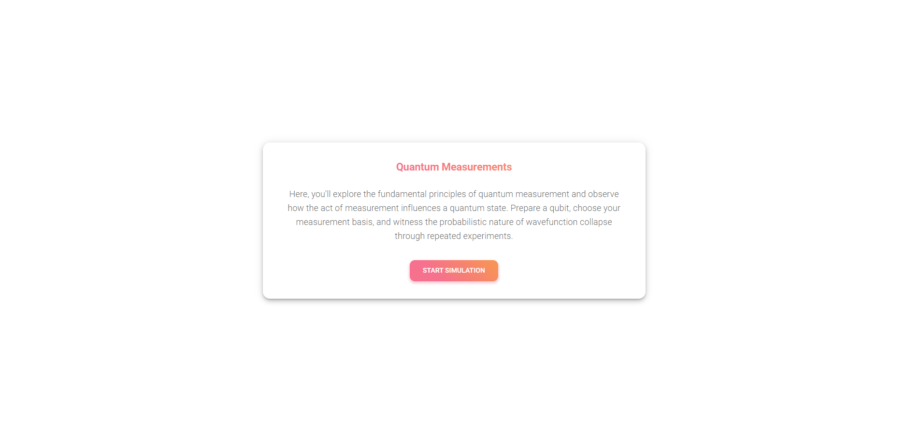
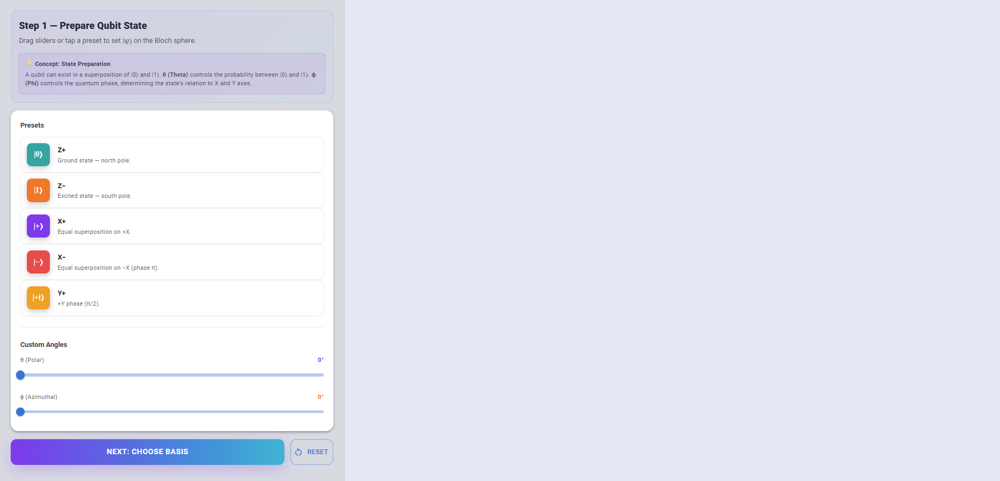
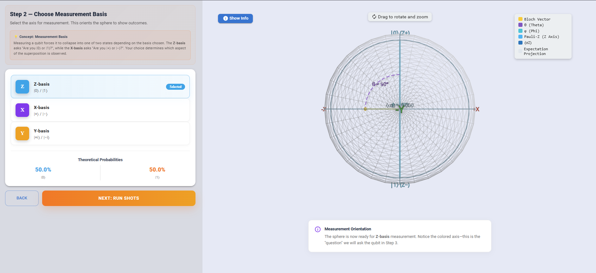
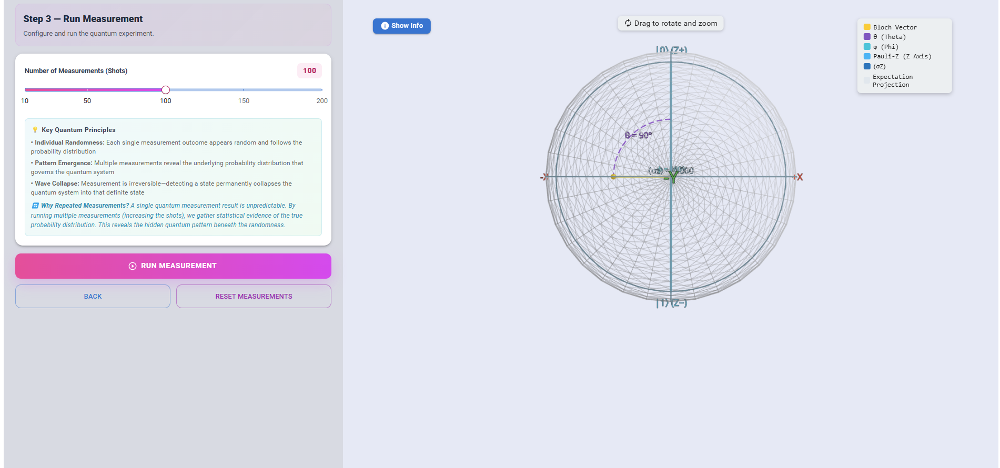

#### Step 1: Introduction 

Read the introduction and click start simulation button to start the Quantum Measurements simulation

#### Step 2: Prepare and Choose the Quantum State

Select and prepare the quantum state to be measured (e.g., |0⟩, superposition state).

#### Step 3: Choose the Measurement Basis

Select the measurement basis:

- Computational (Z) Basis: {|0⟩, |1⟩}
- Hadamard (X) Basis: {|+⟩, |-⟩}
- Apply basis rotation if needed

#### Step 4: Run Quantum Shots

Execute the quantum circuit multiple times (100-10,000 shots) and collect measurement outcomes.

#### Step 5: Analyze Results and Statistics

Generate histograms, calculate probabilities, and compare with theoretical predictions.

